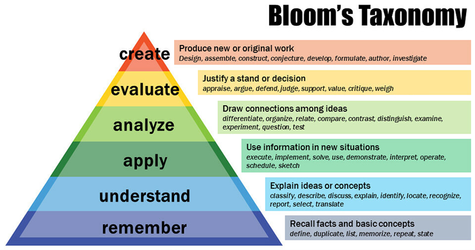

<!-- page_id: 02060000_en -->
<!-- parent_id: 02000000_en -->
<!-- lang_code: en -->

# 06 Digital Questions

*v1.0 – 15 December 2025*

by Thomas Reimann¹, Rudolf Liedl¹, Markus Giese², Roland Barthel²,  
Edith Grießer³, Steffen Birk³, Oriol Bertran⁴, Daniel Fernàndez-Garcia⁴

¹ TU Dresden, Institute for Groundwater Management  
² University of Gothenburg, Department of Earth Sciences  
³ University of Graz, Department of Earth Sciences, NAWI Graz Geocenter  
⁴ Polytechnical University of Catalonia, Department of Civil and Environmental Engineering, Spain  

---

> **Disclaimer**  
> This document represents a static snapshot of the *iNUX Electronic Questions and Assessments report* at the time of publication.  
>  
> The most recent online version is available at the gw-inux GitHub repository:  
> <https://github.com/gw-inux/iNUX-Handbook/tree/main/Digital_Questions>

---

## Content

1. [Introduction](#1-introduction)  
2. [Fundamentals](#2-fundamentals)  
3. [Benefits and limitations for using Multiple-Choice questions](#3-benefits-and-limitations-for-using-multiple-choice-questions)  
4. [Construction/Development of Multiple Choice Questions](#4-constructiondevelopment-of-multiple-choice-questions)  
5. [Implementation of Questions](#5-implementation-of-questions)  
6. [Documentation of the iNUX JSON format](#6-documentation-of-the-inux-json-format)  
7. [TransferACE to generate different assessment formats](#7-transferace-to-generate-different-assessment-formats)  
8. [The iNUX question pool](#8-the-inux-question-pool)  
9. [References](#references)

---

# 1 Introduction

Electronic questions are essential tools in education for assessing existing knowledge and monitoring and evaluating learning progress. Within the iNUX project, interactive teaching materials are developed, including electronic assessments that support self-learning and structured instruction. All questions are created, collected, and shared in accordance with open-source principles to enable reuse, transparency, and community contributions.

This report provides a general introduction to the role and implementation of electronic questions in the iNUX framework. It outlines key principles of assessment, including question types, use cases, as well as forms of application and implementation. Furthermore, it describes the methods and tools used to generate, manage, and distribute questions. The report also introduces the iNUX question pool and explains the underlying principles for its development and use.

# 2 Fundamentals

Clear learning objectives are essential for structuring teaching and guiding the learning process. According to the principle of constructive alignment (Biggs 1996), assessments play a central role in steering learners toward the intended outcomes: what is assessed strongly influences what students focus on and how they prepare.

Learning objectives describe the expected outcomes of a learning process. Bloom's taxonomy (Forehand 2010) provides a hierarchical structure for classifying cognitive skills:

- **Remembering** – recalling facts or basic information  
- **Understanding** – explaining concepts or relationships  
- **Applying** – using knowledge in new or practical situations  
- **Analyzing** – breaking information into components and identifying patterns  
- **Evaluating** – making judgments based on criteria or standards  
- **Creating** – producing new or original work  

These levels are arranged in increasing order of complexity. Figure 1 shows a typical graphical representation of Bloom’s taxonomy.



*Figure 1: Bloom’s revised taxonomy. Vanderbilt University Center for Teaching,  
<https://www.flickr.com/photos/vandycft/29428436431>*

Assessments can be classified as:

- **Diagnostic assessments** – conducted before learning  
- **Formative assessments** – conducted during learning  
- **Summative assessments** – conducted after learning  

Additional use cases include self-assessments, classroom discussions, and embedded assessments integrated directly into digital learning materials.

Common digital question types include:

- Single-choice and multiple-choice questions  
- True/False questions  
- Matching and ordering questions  
- Fill-in-the-blank questions  
- Numerical/calculated questions  
- Image- or map-based identification  
- Free-text/essay questions  

Implementing electronic questions requires appropriate digital infrastructure such as LMS platforms (e.g. Moodle, Canvas) and interactive applications.

# 3 Benefits and limitations for using Multiple-Choice questions

Multiple-choice questions play an important role in digital education because they can be used effectively for diagnostic and formative assessments. Diagnostic use helps identify prior knowledge before learning begins, and formative use supports learners during the learning process. In the iNUX project, these questions are delivered mainly as self-assessments, classroom assessments, and embedded assessments within interactive apps. This aligns well with the overall focus on flexible, learner-centered digital materials.

Multiple-choice questions are formed by a so-called *item*. The item is the complete unit used for assessment and includes the following components:

- **Vignette**: provides the context or background information but does not ask the question.

- **Stem**: the specific question to be answered.

- **Answer options**: among these options, one or several may be correct, while the remaining options function as distractors.

- **Feedback**: can be provided for correct and incorrect choices, depending on the instructional setting.

To avoid ambiguity, it is useful to note that the term *multiple choice* is used inconsistently in different contexts. In some cases, it refers to the number of options offered, while in others it refers to the number of correct answers allowed. For clarity, the distinction between the following two types is applied throughout this report:

- multiple-choice questions with a single selection, and  
- multiple-choice questions with multiple selections.

Using multiple-choice questions offers several benefits. The structure of the item is clear and transparent, making it easy for learners to understand what is being asked and what information is provided. The format is straightforward to construct because all elements are well defined. Multiple-choice questions are widely supported across digital platforms, and most learning-management systems offer standardized import and export functions. Initial item construction can be partially automated with large language models, depending on the required cognitive level. Once implemented, these questions can be used very efficiently, as they require little or no manual correction and can be employed in unsupervised settings.

At the same time, multiple-choice questions have limitations. In some educational contexts, such as formal summative assessments, their use may be restricted or prohibited by examination regulations. Constructing high-quality distractors can be challenging, as they must be plausible without being misleading or trivial. Furthermore, if items are not parametrized or varied, learners may adopt pattern-matching strategies, remembering the correct options without engaging with the underlying concepts.

These considerations explain why the subsequent sections of this report focus primarily on multiple-choice questions. They offer a practical balance between clarity, scalability, interoperability, and technical feasibility within the digital workflows used in the iNUX project.


# 4 Construction/Development of Multiple Choice Questions

The construction of multiple-choice questions follows established principles derived from assessment design guidelines (e.g., CTE 2025). These guidelines help ensure that items are clear, aligned with learning objectives, and suitable for use in different instructional settings. The key principles are summarized in the following list.

- **Alignment with learning objectives**: Items should directly assess the intended learning outcome and correspond to the targeted cognitive level (e.g., remembering, understanding, applying). The question should not require skills outside the intended scope, such as excessive calculation or linguistic interpretation.

- **Clarity and precision of the vignette**: The vignette should provide all information needed to answer the question without ambiguity. Unnecessary detail should be avoided, while essential context must be clearly stated.

- **Focus on a single, well-defined problem**: Each item should test only one concept or skill. Combining several ideas in a single question increases cognitive load and makes interpretation of results more difficult.

- **Meaningful question formulation**: The stem (the question to be answered) should be written in a complete and clear form that permits answering it without reading the answer options. Negative phrasing (e.g., “Which statement is not…?”) should be avoided unless pedagogically justified.

- **Plausible and concept-based distractors**: Distractors should reflect common misconceptions or errors in reasoning. They must be plausible to learners who do not fully understand the concept, while still clearly incorrect for those who do. Distractors should not differ from correct answers in irrelevant ways (e.g., length, vocabulary, formatting). An essential element in item construction is the development of appropriate distractors. One effective approach is to draw on experience from previous assessments and incorporate common incorrect responses provided by students, if such information is available. This helps ensure that distractors meaningfully differentiate between levels of understanding.

- **Avoidance of cues or patterns**: Options should be homogeneous in structure and length, and the placement of correct answers should vary. Unintentional patterns (e.g., “C is often correct”) reduce the diagnostic value of the items.

- **Independence from trivial test-taking strategies**: Questions should not be solvable through elimination of obviously wrong answers, detection of linguistic cues, or pattern recognition. Items should encourage conceptual understanding rather than superficial heuristics.

- **Avoid unnecessary complexity**: While items may target higher cognitive levels, complexity should result from the underlying concept—not from wording, formatting, or excessive numerical detail.

- **Suitability for parameterization**: Where possible, items should be constructed in a way that allows numerical values or contextual parameters to be varied without altering the underlying concept. Parameterization supports reuse, reduces pattern memorization, and enables dynamic generation of variants.

- **Review and iterative refinement**: Each item should be evaluated systematically with regard to clarity, alignment, cognitive level, and distractor quality. Pilot testing or expert review can identify ambiguities or unexpected solution paths.

The following examples illustrate how differences in item construction can influence the clarity and effectiveness of multiple-choice questions.

An example item that aligns well with recommended design principles is provided below.

> **Vignette**: A pumping test is conducted in a confined aquifer. After a period of constant-rate pumping, the drawdown is measured in an observation well located at some distance from the pumping well.  
>  
> **Stem**: Which parameter primarily controls the rate at which drawdown propagates through the aquifer?  
>  
> **Options**:  
> A. Well diameter  
> B. Transmissivity  
> C. Aquifer thickness  
> D. Permeability  
>  
> **Explanation**: This item is well constructed for the following reasons.

- The vignette provides the necessary context without unnecessary detail.

- The stem is precise and clearly states the target of the question (“rate at which drawdown propagates”).

- The distractors are plausible: each option represents a system or aquifer property encountered by learners, and incorrect options reflect common misconceptions (e.g., confusing thickness with transmissivity).

- Cognitive level: Understanding (or Applying, depending on curriculum).

In the following, two examples are presented that do not fully meet recommended design principles.

> **Vignette**: Groundwater heads can change for many different reasons.  
>  
> **Stem**: Which factor does not influence groundwater heads?  
>  
> **Options**:  
> A. Recharge from precipitation  
> B. Pumping from wells  
> C. Evapotranspiration  
> D. All of the above  
>  
> **Explanation**: This item does not meet recommended design principles for the following reasons.

- Incorrect answer structure: All listed factors influence groundwater levels, so none of the options meaningfully satisfies the question. The option “All of the above” is logically incompatible with the stem.

- Overly broad vignette: The vignette does not provide specific context or focus the question, making the item too general.

- Weak distractors: Each option is a valid factor influencing groundwater levels; therefore, the distractors do not function as distractors.

- Negative phrasing: Negative formulations should be avoided unless pedagogically justified.

Another example of an item that does not meet recommended design principles is shown below.

> **Vignette**: A well is installed in an unconfined aquifer.  
>  
> **Stem**: How much will the groundwater level decline after pumping?  
>  
> **Options**:  
> A. 2 meters  
> B. It depends on the pump  
> C. A lot  
> D. 0.5 meters  
>  
> **Explanation**: This item does not meet recommended design principles for the following reasons.

- Missing essential information: The vignette does not include pumping rate, aquifer properties, distance to the observation point, or duration of pumping.

- Vague and imprecise distractors: Options such as “A lot” or “It depends on the pump” are not meaningful scientific responses and offer no diagnostic value.

- Arbitrary numerical values: The numerical options (2 m and 0.5 m) appear random and are not tied to any scenario, reducing their relevance.

- No conceptual focus: The item does not test a specific concept (e.g., drawdown prediction, Theis solution, aquifer characteristics) and instead invites guessing.

Once an item is drafted, it should undergo a structured review to ensure clarity, alignment, and technical suitability. A checklist helps standardize this process and maintain consistency across items. Relevant aspects include:

- classification of the item according to Bloom’s taxonomy (see Figure 1),

- clarity and precision of both the vignette and the stem,

- evaluation of whether distractors are sufficiently plausible and not overly simple,

- assessment of whether the item is suitable for parameterization and can be varied without altering its conceptual focus.

Applying this systematic review helps enhance the quality of multiple-choice questions and supports their effective integration into the assessment workflows used in the iNUX project.


# 5 Implementation of Questions

Multiple-choice questions can be implemented in various formats depending on the intended use and the technical environment. The main formats covered by the iNUX materials are:

- **Formatted text**: Traditional formats include print-based materials such as books, PDFs, or Word documents, where questions are read directly and answered on paper. This format is very useful for reading and for gaining an overview of the questions.

- **iNUX JSON format**: For digital learning environments, the iNUX project uses a defined JSON format that is human-readable, easy to implement, and suitable for transferring questions between applications.

- **Moodle XML**: Moodle is an open-source learning-management system widely used in higher education. Its XML-based question format allows structured import and export of questions, including metadata, feedback, and multimedia elements.

- **QTI 2.1**: QTI (Question and Test Interoperability) is an international standard for digital assessments developed by the IMS Global Learning Consortium. The QTI 2.1 format, used in platforms such as OPAL, supports interoperable exchange of questions and tests across different systems.

- **Particify**: Particify is a digital audience-response system designed for classroom interaction (classroom assessment). It supports structured question formats and real-time response collection and visualization.

The choice of platform determines how the questions can be used in practice. In print-based settings, learners typically read a book or document, mark the correct options manually, and compare their answers using a solution key. The iNUX JSON format is well suited for integration into Streamlit applications, where questions can be embedded directly into interactive learning tools; however, the current implementation does not yet support randomization of the answer order. Moodle XML is used within learning-management systems and supports additional functionalities, such as randomized answer order, structured feedback, and the inclusion of figures to support understanding. The QTI format, as used in OPAL, follows similar principles and enables systematic handling of digital assessments. Particify, once integrated, offers strong support for classroom-based assessments because of its effective response handling and post-processing features.

# 6 Documentation of the iNUX JSON format

The iNUX project uses a dedicated JSON format to store and exchange multiple-choice questions in a structured and platform-independent way. The format is human-readable, easy to edit, and well suited for integration into interactive applications such as Streamlit tools. Each question is represented as a JSON object that contains the question text, the answer options, the correctness of each option, and feedback for use in digital applications. This structure supports transparency and allows straightforward conversion into other formats such as Moodle XML or QTI 2.1.

**Generic example of an iNUX JSON question:**

```
{
  "question": "Which of the following statements is correct?",
  "options": {
    "Option A": false,
    "Option B": true,
    "Option C": false,
    "Option D": false
  },
  "success": "Correct. Option B is the right answer.",
  "failure": "Incorrect. Review the concepts and try again."
}

```


This example illustrates the minimal structure:

- the **question** field contains the vignette and stem;
- the **options** field stores answer choices with their truth values;
- the **success** and **failure** fields provide feedback for correct or incorrect responses.

The format can support additional metadata when needed (e.g., item identifiers, tags, or Bloom levels), but it remains lightweight and easy to process.


# 7 TransferACE to generate different assessment formats

TransferAce is a Streamlit-based tool that converts multiple-choice questions from the iNUX JSON format into QTI 2.1 packages, Moodle XML files, and editable Word documents. TransferAce is designed to support the reuse of questions across different learning platforms and formats. The application is available for download and local use as well as as a web service via Streamlit Cloud (<https://inux-transferace.streamlit.app/>). Figure 2 shows the main interface of TransferAce with file upload, format selection, and configuration sections for QTI, Moodle, and Word export.


*Figure 2: Screenshots from TransferAce.*

The tool expects a single `.json` file containing one or more questions in the iNUX JSON format. After uploading the file, users can select one or more output formats. For Moodle, the tool creates a standard Moodle XML file with multiple-choice questions, including automatic handling of single- and multiple-correct items, scoring fractions, and feedback. For QTI 2.1, TransferAce generates a ZIP package containing individual item files and a manifest that can be imported into systems such as OPAL. For Word export, TransferAce generates DOCX documents via an intermediate Markdown representation, with two variants: a student version containing only questions and answer options, and a teacher version including the correct/incorrect flags and feedback texts.

For each target format, TransferAce offers additional configuration options. In the QTI and Moodle exports, users can choose whether to strip prefixes such as “A)” or “1)” from the answer options to allow random ordering of questions in the respective LMS. Users can also define whether inline LaTeX expressions should be converted and whether the order of answers should be shuffled. In the Moodle export, default grade, penalty, and answer numbering can be defined, and an option is available to automatically detect single-correct questions. During conversion, the tool performs basic validation of the JSON structure and provides error messages if required fields are missing or incorrectly formatted.

## Running TransferAce locally (with Pandoc support)

To use the full functionality of TransferAce, including the export of Word documents, the application must be run locally with Pandoc installed. The following steps outline a minimal setup.

- **Clone or download the TransferAce repository**  
  Download the project folder from GitHub or extract the ZIP archive to any location on your computer.

- **Create and activate a Python environment**

```bash
python -m venv venv
source venv/bin/activate    # macOS / Linux
venv\Scripts\activate       # Windows

```

- **Install the required Python packages: From within the project folder,
  run**

```bash

pip install -r requirements.txt

```

- **Install Pandoc: Pandoc is required for the DOCX export.**

```bash

  - Windows/macOS: Download the installer from
    https://pandoc.org/installing.html

  - Linux:

sudo apt-get install pandoc

```

- **After installation, verify that Pandoc is accessible:**

```bash
pandoc \--version

```

- **Start TransferAce: From the project folder, run:**

```bash

streamlit run TransferACE.py

- Access the application: Once started, Streamlit will open the app in
  your browser at:

http://localhost:850x

(with x a number starting with 1 and depending how many Streamlit Apps
are already running locally on your system.)

```

When Pandoc is installed and available on your system, the Word export
appears as an active option in TransferAce. On systems without Pandoc,
the Word export is automatically disabled.


# 8 The iNUX question pool

The iNUX question pool organizes all available items according to the current categorization system used within the project. If the questions are thematically similar, each question set is assigned to one of the defined categories and subcategories to support discoverability and thematic coherence. In some cases, full assessments or larger collections of questions span multiple domains and cannot be placed meaningfully within a single category. For such cases, a dedicated section titled *“Multi-Domain Assessments”* is used. Within this section, additional metadata (e.g., a README file) indicates the specific domains covered by the respective collection, ensuring that users can still navigate content based on the underlying thematic scope.

The question pool contains several file formats to support different use cases and technical environments. Each set of questions is provided as:

- a Word document (`.docx`) and a corresponding PDF for easy reading and printing.

In addition, three digital assessment formats are included:

- an iNUX JSON file for use in Streamlit apps and modules;
- a Moodle XML file for direct import into learning-management systems; and
- a QTI 2.1 package compatible with platforms such as OPAL.

To complement these formats, the iNUX project also provides selected questions in Streamlit applications, allowing users to view and interact with them directly in a web-based interface. These applications can serve as quizzes, for example implemented as multipage applications, or as preview tools that enable users to browse and test questions in the same environment used for the digital learning materials. An example is the quiz *“How much do I know about hydrogeology”*, which can be accessed at  
<https://quiz-know-about-hydrogeology.streamlit.app/>.

To use the question pool effectively, it is recommended to first consult the Word or PDF versions to gain an overview of the available items and their structure. These documents provide the most accessible summary for initial review and selection. The digital formats (Moodle XML and QTI) can then be imported into the respective platforms for further editing, integration into courses, or deployment in teaching activities. As Streamlit-based previews become available, they will offer an additional way to explore the content interactively and evaluate its suitability for specific teaching contexts.

Currently, the questions are hosted in the following iNUX GitHub repositories:

🠚 <https://github.com/gw-inux/iNUX-Interactive-Documents>  
🠚 <https://github.com/gw-inux/iNUX-Question-Pools>


# References

Biggs, J. (1996). Enhancing teaching through constructive
alignment. Higher education, 32(3), 347-364.

Forehand, M. (2010). Bloom's taxonomy. Emerging perspectives on
learning, teaching, and technology, 41(4), 47-56.

CTE (2025). Designing multiple-choice questions. Centre for Teaching
Excellence, University of Waterloo.
<https://uwaterloo.ca/centre-for-teaching-excellence/catalogs/tip-sheets/designing-multiple-choice-questions>
(last access 30th Dec. 2025)


<!-- EU_FUNDING_FOOTER -->
<hr style="margin:0.4rem 0;">

<div style="
  display:flex;
  align-items:center;
  gap:0.75rem;
  font-size:0.6rem;
  line-height:1.35;
">
  <div style="flex:0 0 160px; text-align:center;">
    
  </div>
  <div style="flex:1; text-align:justify; hyphens:auto;">
    This project is co-funded by the European Union. However, the views and opinions
    expressed are solely those of the author(s) and do not necessarily reflect those
    of the European Union or the National Agency DAAD. Neither the European Union nor
    the granting authority can be held responsible for them.
  </div>
</div>
