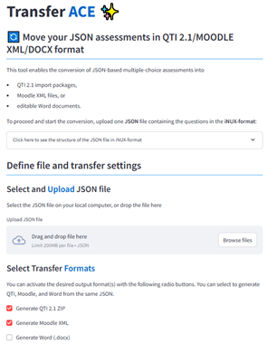

<!-- page_id: 03020100_en -->
<!-- parent_id: 03020000_en -->
<!-- lang_code: en -->

# 01 TransferACE to generate different assessment formats

TransferAce is a Streamlit-based tool that converts multiple-choice questions from the iNUX JSON format into QTI 2.1 packages, Moodle XML files, and editable Word documents. TransferAce is designed to support the reuse of questions across different learning platforms and formats. The application is available for download and local use as well as as a web service via Streamlit Cloud (<https://inux-transferace.streamlit.app/>). Figure 2 shows the main interface of TransferAce with file upload, format selection, and configuration sections for QTI, Moodle, and Word export.




*Figure 2: Screenshots from TransferAce.*

The tool expects a single `.json` file containing one or more questions in the iNUX JSON format. After uploading the file, users can select one or more output formats. For Moodle, the tool creates a standard Moodle XML file with multiple-choice questions, including automatic handling of single- and multiple-correct items, scoring fractions, and feedback. For QTI 2.1, TransferAce generates a ZIP package containing individual item files and a manifest that can be imported into systems such as OPAL. For Word export, TransferAce generates DOCX documents via an intermediate Markdown representation, with two variants: a student version containing only questions and answer options, and a teacher version including the correct/incorrect flags and feedback texts.

For each target format, TransferAce offers additional configuration options. In the QTI and Moodle exports, users can choose whether to strip prefixes such as “A)” or “1)” from the answer options to allow random ordering of questions in the respective LMS. Users can also define whether inline LaTeX expressions should be converted and whether the order of answers should be shuffled. In the Moodle export, default grade, penalty, and answer numbering can be defined, and an option is available to automatically detect single-correct questions. During conversion, the tool performs basic validation of the JSON structure and provides error messages if required fields are missing or incorrectly formatted.

## Running TransferAce locally (with Pandoc support)

To use the full functionality of TransferAce, including the export of Word documents, the application must be run locally with Pandoc installed. The following steps outline a minimal setup.

- **Clone or download the TransferAce repository**  
  Download the project folder from GitHub or extract the ZIP archive to any location on your computer.

- **Create and activate a Python environment**

```bash
python -m venv venv
source venv/bin/activate    # macOS / Linux
venv\Scripts\activate       # Windows

```

- **Install the required Python packages: From within the project folder,
  run**

```bash

pip install -r requirements.txt

```

- **Install Pandoc: Pandoc is required for the DOCX export.**

```bash

  - Windows/macOS: Download the installer from
    https://pandoc.org/installing.html

  - Linux:

sudo apt-get install pandoc

```

- **After installation, verify that Pandoc is accessible:**

```bash
pandoc \--version

```

- **Start TransferAce: From the project folder, run:**

```bash

streamlit run TransferACE.py

- Access the application: Once started, Streamlit will open the app in
  your browser at:

http://localhost:850x

(with x a number starting with 1 and depending how many Streamlit Apps
are already running locally on your system.)

```

When Pandoc is installed and available on your system, the Word export
appears as an active option in TransferAce. On systems without Pandoc,
the Word export is automatically disabled.


<!-- EU_FUNDING_FOOTER -->
<hr style="margin:0.4rem 0;">

<div style="
  display:flex;
  align-items:center;
  gap:0.75rem;
  font-size:0.6rem;
  line-height:1.35;
">
  <div style="flex:0 0 160px; text-align:center;">
    
  </div>
  <div style="flex:1; text-align:justify; hyphens:auto;">
    This project is co-funded by the European Union. However, the views and opinions
    expressed are solely those of the author(s) and do not necessarily reflect those
    of the European Union or the National Agency DAAD. Neither the European Union nor
    the granting authority can be held responsible for them.
  </div>
</div>
